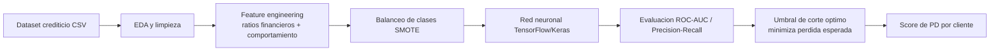

# Credit Risk Neural Network — Probabilidad de Default (PD)

Red neuronal (TensorFlow/Keras) para estimar la probabilidad de incumplimiento crediticio y clasificar clientes deudores vs. no deudores, con optimización del umbral de corte para minimizar la pérdida esperada del portafolio.

## Contexto

En banca y financieras, aprobar un crédito a un cliente que luego incumple genera pérdidas directas, mientras que rechazar a un buen cliente es un costo de oportunidad. El reto no es solo predecir bien, sino elegir el umbral de decisión que minimice la pérdida esperada, considerando el desbalance natural entre clientes sanos y morosos.

## Objetivo

Construir un clasificador binario (deudor vs. no deudor) que estime la PD de cada cliente, con feature engineering sobre ratios financieros y variables de comportamiento, manejo del desbalance de clases y una evaluación centrada en el negocio —curvas ROC/PR y umbral óptimo— en lugar de solo accuracy.

## Arquitectura



## Stack

| Categoría | Herramientas |
|---|---|
| Lenguaje | Python |
| Deep Learning | TensorFlow / Keras |
| ML y datos | scikit-learn, pandas, NumPy |
| Balanceo de clases | SMOTE (imbalanced-learn) |
| Visualización | Matplotlib, Seaborn |
| Entorno | Jupyter Notebook |

## Estructura del proyecto

```
credit-risk-neural-network/
├── data/                     # Coloca aqui Datos_Crediticios.csv (no versionado)
├── credit_risk_model.ipynb   # Notebook principal (EDA -> modelo -> umbral optimo)
├── requirements.txt          # Dependencias
└── README.md
```

## Ejecución

1. Clona el repositorio: `git clone https://github.com/Alvaro192023/credit-risk-neural-network.git`
2. Instala dependencias: `pip install -r requirements.txt`
3. Coloca `Datos_Crediticios.csv` dentro de la carpeta `data/`.
4. Abre `credit_risk_model.ipynb` en Jupyter y ejecuta las celdas en orden.

## Resultados e impacto

- **AUC-ROC de 0.89** en la clasificación deudor vs. no deudor.
- Análisis **Precision-Recall** para operar bajo el desbalance real de clases.
- Selección del **umbral de corte óptimo** orientado a minimizar la pérdida esperada —traduciendo el modelo en una decisión de negocio (aprobar/rechazar), no solo en una métrica estadística.

## Próximos pasos

- Calibración de probabilidades (Platt / isotónica) para reportar PD confiables.
- Explicabilidad con SHAP para sustentar decisiones ante Riesgos y regulación.
- Despliegue como API (FastAPI + Docker) para scoring en tiempo real.

## Licencia y contacto

MIT. Álvaro Villanueva Kobayashi — alvarovillakoba515@gmail.com · [GitHub](https://github.com/Alvaro192023)
